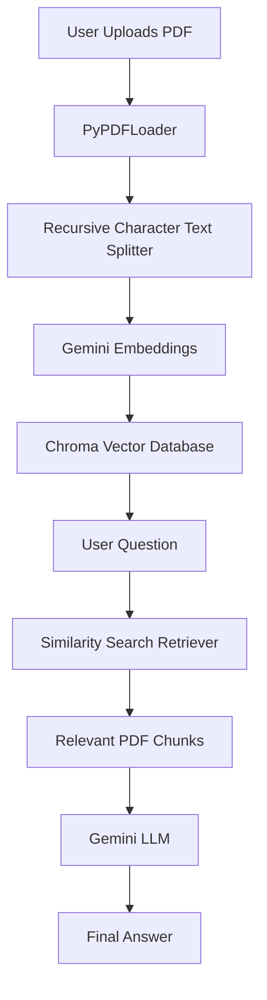

# 📚 LangChain RAG Document Q&A Chatbot

An AI-powered **Document Question Answering Chatbot** built using **Retrieval-Augmented Generation (RAG)**.  
Users can upload a PDF document and ask questions. The chatbot retrieves relevant information from the document and generates accurate answers using Google Gemini.

---

## 🚀 Project Overview

This project demonstrates a complete RAG pipeline:

1. Upload PDF document
2. Extract text from PDF
3. Split document into chunks
4. Generate embeddings
5. Store embeddings in ChromaDB
6. Retrieve relevant document chunks
7. Generate answers using Gemini LLM

---

## 🏗️ Architecture



---

## 🛠️ Tech Stack

### AI / LLM
- Python
- LangChain
- Google Gemini API

### Document Processing
- PyPDFLoader
- RecursiveCharacterTextSplitter

### Vector Database
- ChromaDB

### Frontend
- Streamlit

### Environment
- Python Virtual Environment
- dotenv

---

## 📂 Project Structure

```
langchain-rag-document-chatbot/

│
├── app.py                  # Streamlit UI
│
├── rag.py                  # RAG pipeline logic
│
├── requirements.txt        # Dependencies
│
├── README.md               # Documentation
│
├── .env                    # API key (not committed)
│
├── chroma_db/              # Vector database
│
└── uploaded_pdf.pdf        # Uploaded document
```

---

## ⚙️ Installation

### 1. Clone Repository

```bash
git clone https://github.com/gkaur71591-collab/langchain-rag-document-chatbot.git
```

Move into project:

```bash
cd langchain-rag-document-chatbot
```

---

### 2. Create Virtual Environment

```bash
python -m venv venv
```

Activate:

Windows:

```bash
venv\Scripts\activate
```

---

### 3. Install Dependencies

```bash
pip install -r requirements.txt
```

---

## 🔑 Environment Setup

Create a `.env` file:

```env
GOOGLE_API_KEY=your_google_api_key
```

Do not commit this file.

---

## ▶️ Run Application

Start Streamlit:

```bash
streamlit run app.py
```

Application opens:

```
http://localhost:8501
```

---

## 💬 Example Questions

After uploading a PDF:

```
What is the main topic of this document?
```

```
Summarize this document.
```

```
What are the key points?
```

For medical reports:

```
What is the patient's name?
```

```
What diagnosis was given?
```

```
What medicines were prescribed?
```

---

## 🔄 RAG Workflow

```
PDF Upload

    ↓

Document Loading

    ↓

Text Chunking

    ↓

Embedding Generation

    ↓

Chroma Vector Database

    ↓

Similarity Search

    ↓

Context Retrieval

    ↓

Gemini LLM

    ↓

Answer Generation
```

---

## ✨ Features

✅ PDF document upload  
✅ Semantic document search  
✅ AI-generated answers  
✅ Chroma vector database  
✅ Gemini LLM integration  
✅ Streamlit user interface  

---


## 👩‍💻 Author

**Gagandeep Kaur**

Backend Developer | Python | Laravel | LangChain | Generative AI
