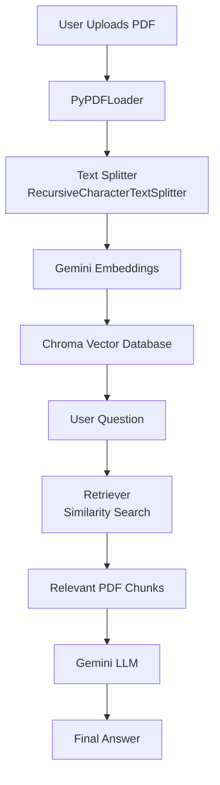

```mermaid
flowchart TD

A[User Uploads PDF] --> B[PyPDFLoader]

B --> C[Text Splitter<br/>RecursiveCharacterTextSplitter]

C --> D[Gemini Embeddings]

D --> E[Chroma Vector Database]

E --> F[User Question]

F --> G[Retriever<br/>Similarity Search]

G --> H[Relevant PDF Chunks]

H --> I[Gemini LLM]

I --> J[Final Answer]
```